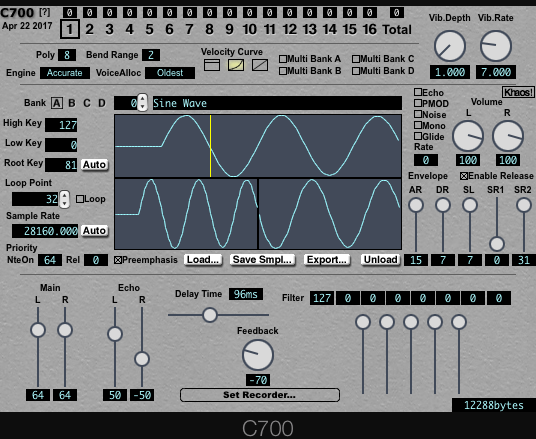
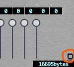
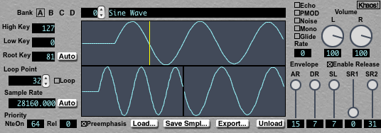

#How to Use C700

* スーファミ内蔵音源をエミュレートした、ソフトウェアサンプラーです。
* ループポイントが設定されたAIFF(Macのみ)WAVファイルの読み込みに対応しています。
* AddmusicM形式の生BRRの読み書きに対応しています。
* SPCモジュールを取り付けた[G.I.M.I.C](http://gimic.jp)と同期して実チップ演奏させることができます。
* USBハードウェアを認識すると、UI右下にアイコンが表示されます。

## 動作環境
### macOS版
*  Mac OS X 10.6 以降のIntel Mac
* Audio Units または VST2.4に対応したホストアプリケーション(32/64bit)

### Windows版
* Windows Vista 以降のVST2.4に対応したホストアプリケーション(32/64bit)

## 動作確認済ホスト
### macOS

* Logic Pro 9 (32/64bit) (10.10.5)
* Logic Pro X 10.2.4 (64bit) (10.10.5)
* Digital Performer 8 (32/64bit) (10.8.5)
* Digital Performer 9.12 (32/64bit) (10.10.5)

### Windows

* Cubase 8 (32/64bit) (Windows 8.1)

## Mac版とWindows版の違い
* Mac版では、AIFF,WAV,SD2の波形データが読み込めますが、Windows版ではWAVのみです(不具合あり)
* Mac版では、動作中にUSBハードウェアの挿抜を認識しますが、Windwos版はプラグイン起動時にのみチェックが行われます。
* おそらくMac版の方が安定しています。

## 機能説明
* 各種波形データを、直接読み込み可能です。
* AIFF(Macのみ),WAV,SPC,AddmusicM形式のbrrファイルに対応しています。
* 128波形まで登録することができます。
* プログラムチェンジ、ピッチベンド、モジュレーションホイールに対応しています。
	* MIDIチャンネル毎に設定されます。
* 再生波形の最大サンプリングレートは120kHzです。
* 通常は、波形番号がプログラムチェンジに対応しています。
	* あるいは、複数の波形を１つのバンクとして扱う事が出来ます。
* バンクは全体で４つまで使用でき、各バンクをマルチサンプルモードに設定する事が出来ます。
	* マルチサンプルモードに設定したバンクは、バンク中の波形番号いずれかをプログラムチェンジで選択した場合、該当するバンクを選択したことになります。
	* 波形のHighKey, LowKey設定は、マルチサンプルモードでのみ有効になります。

## 共通設定

全MIDIchに共通の設定を行います。

<dl>
  <dt>トラック1-16</dt>
  <dd>1-16 MIDIチャンネルの発音状態と、選択状態を表します。</dd>
  
  <dt>Engine</dt>
  <dd>Old: 古いバージョンとの互換性のためのモードです。</dd>
  <dd>Relaxed: 波形メモリを容量の制限無く使用できます。16音まで同時発音数を増やす事が出来ます。いくつかの仕様が実機と異なります。</dd>
  <dd>Accurate: Blargg's Audio Engineを使用した、より厳密なエミュレーションを行います。このモードでは"Poly"の設定値が無視され、"8"に固定されます。</dd>
  
  <dt>VoiceAlloc</dt>
  <dd>Oldest: ノートオン時に、古い発音を優先して消音します。自然な演奏になりやすいです。</dd>
  <dd>SameCh: ノートオン時に、同じチャンネルを優先して確保するようにします。記録した演奏データが小さくなる場合があります。</dd>
  
  <dt>Poly</dt>
  <dd>全体の同時発音数(1-16)を設定します。</dd>

  <dt>Bend Range</dt>
  <dd>ピッチベンドレンジ設定します。</dd>

  <dt>Velocity Curve</dt>
  <dd>ベロシティカーブを、一定値、2次曲線、直線のいずれかに設定します。</dd>

  <dt>Multi Bank A-D</dt>
  <dd>C700には、複数の波形を一つの音色として扱う事の出来るバンクが４つあります。</dd>
  <dd>ここでOnにしたバンクはマルチサンプルモードに設定され、</dd>
  <dd>LowKey, HighKeyの設定が有効になり、サンプルのキーマッピングが行われます。</dd>
  <dd>ドラムキットを組む場合などに便利です。</dd>
  <dd>キー範囲が重複した場合、後の番号のサンプルの範囲が優先されます。</dd>
  <dd>マルチサンプルモードに設定していないバンクは、波形番号＝プログラムチェンジ番号になります。</dd>

  <dt>Vibrato Depth,Rate</dt>
  <dd>モジュレーションホイール(CC:1)の掛かり具合を調節します。</dd>
  <dd>現在の所、全MIDIch共通です。</dd>
</dl>

## 波形毎の設定

選択トラックの、現在の音色設定を編集できます。

<dl>
	<dt>Bank</dt>
	<dd>波形の属するバンクを設定します。</dd>
	<dd>マルチサンプルモードのバンクを選択すると、同じバンクの波形全てが同じ音色として扱われます。</dd>
	<dd>マルチサンプルモードでないバンクを選択した場合は、波形番号＝プログラムチェンジ番号となります。</dd>
	
	<dt>波形番号/ラベル</dt>
	<dd>プログラムチェンジで選択されている波形番号と、名前が表示されます。</dd>
    
	<dt>Low Key, High Key</dt>
	<dd>下限と上限音程を設定します。</dd>
	<dd>マルチサンプルモードでない場合はここでの設定は無視されます。</dd>
    
	<dt>Root Key</dt>
	<dd>波形の基準音程を設定します。</dd>
	<dd>C4=60です。</dd>
	<dd>一応、自動検出機能付き。</dd>
    
	<dt>Loop Point / Loop</dt>
	<dd>波形のループon/off、ループポイントを設定します。</dd>
	<dd>brrの仕様上、16サンプル単位に限定されます。</dd>
    
	<dt>Sample Rate</dt>
	<dd>基準音程で再生した時の、サンプリングレートを設定します。</dd>
	<dd>一応、自動検出機能付き。</dd>
    
	<dt>Priority</dt>
	<dd>優先度の設定をします。ノートオン時に、最大発音数を超えていた場合、最も優先度が低く、かつ、最も古い音が消音されます。</dd>
	<dd>NteOn(NoteOn)</dd>
	<dd>ノート・オン時にボイスに設定される優先度です。</dd>
	<dd>Rel(Release)</dd>
	<dd>ノート・オフ時にボイスに設定される優先度です。</dd>
    
	<dt>波形表示</dt>
	<dd>選択中の波形と、ループ終端〜開始点を表示します。</dd>
    
	<dt>PreEmphasis</dt>
	<dd>Onにすると、WAVやAIFF読み込み時に高域強調フィルタを掛けます。</dd>
	<dd>この処理によって、発音時のDSP処理による高域の減衰を補償し、元波形の音質に近づけることが出来ます。</dd>
	<dd>この処理により波形がクリップする場合、自動的にノーマライズ処理を行います。</dd>
    
	<dt>Load</dt>
	<dd>表示中の番号に波形データを読み込みます。</dd>
	<dd>ファイルのドラッグ＆ドロップによっても読み込むことが出来ます。</dd>
	<dd>AddmusicM形式(.brr)の他、AIFF(Macのみ), WAV, SPCに対応しています。</dd>
	<dd>ステレオデータを読み込んだ場合、自動的にモノラルデータに変換されます。</dd>
	<dd>WAV, AIFFでループポイント、キー情報が設定されている場合、反映されます。</dd>
	<dd>ループ長が16サンプルの倍数でないファイルを読み込むと、自動的にサンプリングレート変換が行われ、16サンプル単位になるように調整されます。</dd>
	<dd>古いバージョンでセーブされた、独自形式(.brr)波形ファイルは、Mac AU版でのみ読み込みのみに対応しています。</dd>
	<dd>波形ファイルは、最大で116480サンプルまでしか読み込まれません。</dd>
	<dd>.brrファイル(.smplファイル無し)、.spc読み込み時のサンプリングレートは自動検出されます。</dd>
    
	<dt>Save Smpl...</dt>
	<dd>表示中の波形データを生brr形式で保存します。</dd>
	<dd>保存すると、同じ場所に同名の、.smplファイルが作られますが、</dd>
	<dd>音色情報が保存されていますので、移動または削除しないようにして下さい。</dd>
    
	<dt>Export...</dt>
	<dd>表示中の波形あるいは、バンクをFastTrackerII音色データ形式(XIフォーマット)で保存します。</dd>
	<dd>マルチサンプルモードに設定された音色の場合、複数の波形を含んだ音色として出力されます。</dd>
    
	<dt>Unload</dt>
	<dd>表示中の波形を破棄します。</dd>
    
	<dt>Echo</dt>
	<dd>波形の発音時に、エコーをOnにします。</dd>
    
	<dt>PM</dt>
	<dd>波形の発音時に、ピッチモジュレーションレジスタをOnにします。</dd>
	<dd>ピッチモジュレーションは、１つ前のボイスchの出力によって周波数変調されます。</dd>
	<dd>変調元のchを制御するには、"Mono"をOnにする事で、発音ボイスチャンネルを固定してください。</dd>
	
	<dt>Noise</dt>
	<dd>波形の発音時に、ノイズをOnにします。</dd>
	<dd>ノイズの周波数は全chで共通のため、複数のノイズ設定音色を鳴らした場合、最後に発音した周波数が設定されます。</dd>
	
	<dt>Mono</dt>
	<dd>Onにすると、その波形は常に単音で発音されるようになります。</dd>
	<dd>設定された音色は、常に固定されたボイスチャンネルを確保します。1-8MIDIchは1-8ボイスチャンネルに、9-16MIDIchは1-8MIDIChに対応します。</dd>
	<dd>また、２音目以降の発音では、キー・オンを行いません。（レガート）</dd>
    
	<dt>Glide</dt>
	<dd>Onにすると、ポルタメント効果が得られます。</dd>
    
	<dt>Rate</dt>
	<dd>ポルタメントの速さを設定します。</dd>
    
	<dt>Volume</dt>
	<dd>波形発音時の音量を設定します。</dd>
	<dd>マイナスに設定すると逆相になります</dd>
    
	<dt>AR,DR,SL,SR1,SR2</dt>
	<dd>ハードウェアエンベロープの設定をします。</dd>
	<dd>キーオン中はSR1のSRが設定され、キーオフ後にSR2の値に切り替わります。</dd>
	
	<dt>Enable Release</dt>
	<dd>offに設定した場合、ノートオフ時にSR2に移行せず、即座にキーオフします。</dd>
    
	<dt>Khaos!</dt>
	<dd>ランダムな波形を生成します。</dd>
</dl>

## エコー設定

内蔵のエコーに関する設定をします。全ch共通です。

<dl>
	<dt>Main</dt>
	<dd>メインボリュームを設定します。</dd>
	<dd>マイナスにすると逆相になります。</dd>

	<dt>Echo</dt>
	<dd>エコー成分の音量を調節します。</dd>
	<dd>マイナスにすると逆相になります。</dd>

	<dt>Delay Time</dt>
	<dd>ディレイタイムを設定します。</dd>

	<dt>Feedback</dt>
	<dd>フィードバック量を設定します。</dd>
	<dd>マイナスにすると逆相になります。</dd>
	<dd>大きくしすぎると発振する場合があります。</dd>

	<dt>Filter</dt>
	<dd>Wet音にかけるフィルタの設定をします。</dd>
	<dd>直接数値で入力(-128〜127)の他、</dd>
	<dd>EQスライダーを使って視覚的に設定することも出来ます。</dd>

	<dt>RAMシミュレーション</dt>
	<dd>読み込まれている全波形と、エコーの使用により消費するメモリの合計を表示します。</dd>
	<dd>スーファミ実機で使用できるメモリは、ドライバ、シーケンスデータを含め、64kBまでです。</dd>
	<dd>実機で可能な容量を超えた場合、赤字で表示されます。</dd>
	<dd>赤字表示時に動作がおかしくなった場合は、プラグインを再読み込みしてください。</dd>
</dl>

## 演奏の録音

区間を設定してその範囲を再生すると、演奏が記録されます。spc形式またはrom形式で保存する事ができます。
メイン画面下部の"Set Recorder..."ボタンをクリックすると、設定画面が開きます。
初回の場合は、演奏用のコードの読み込みを促すメッセージが表示されますので、
配布サイトと同じページ内([http://picopicose.com/software.html](http://picopicose.com/software.html))にある、"playercode.bin"を入手し、
画面内にドラッグ＆ドロップしてください。正常に読み込まれた場合、以下の画面が表示されます。

<dl>
	<dt>Save Path</dt>
	<dd>記録が終了したとき、ファイルはここで設定したフォルダに保存されます。</dd>
		
	<dt>Save as *.spc</dt>
	<dd>spcファイルを書き出したい場合はチェックします。</dd>
	<dd>APU内部の1/16000秒周期に設定されたタイマーを使って演奏されるため、62.5usの分解能で記録されます。</dd>
	<dd>spcファイルは64KBの制限のため、長い曲や、波形メモリを多く使っている場合、区間の最後まで出力されない場合があります。</dd>
	
	<dt>Save as *.smc</dt>
	<dd>rom形式のファイルを書き出したい場合はチェックします。</dd>
	<dd>水平同期割り込みを利用して演奏されるため、NTSCでは1/15734秒、PALでは1/15625秒の分解能で記録されます。</dd>
	<dd>32Mbitのromに格納できるサイズまで録音できます。</dd>
	
	<dt>smc Format</dt>
	<dd>出力romファイルをNTSC仕様にするか、PAL仕様にするかを選択します。</dd>
	<dd>NTSCとPALでは、記録する分解能が異なります。</dd>
	
	<dt>PlayerCode</dt>
	<dd>playercode.binが正常に読み込まれていれば、"Valid"と表示されます。</dd>
	<dd>Loadボタンで、playercode.binの更新を行う事ができます。</dd>
</dl>

以上の設定は、初期設定ファイルに保存され、プラグインを新しく起動したときにも以前の設定が残ります。
初期設定ファイルは、macOSの場合、"~/Library/Application Support/C700/C700.settings"に、Windowsの場合、"[ホームフォルダ]/AppData/Roaming/C700/C700.settings"に保存されます。

<dl>
	<dt>Record Start Pos [ppq]</dt>
	<dd>記録を開始する位置を設定します。</dd>
	<dd>Setをクリックするとソングポインタの現在位置が設定されます。</dd>

	<dt>Loop Start Pos [ppq]</dt>
	<dd>ループポイントの位置を設定します。</dd>
	<dd>Setをクリックするとソングポインタの現在位置が設定されます。</dd>

	<dt>Record End Pos [ppq]</dt>
	<dd>記録を終了する位置を設定します。</dd>
	<dd>Setをクリックするとソングポインタの現在位置が設定されます。</dd>

	<dt>Game Title</dt>
	<dd>spcファイルまたはsmcファイルに設定されるゲーム名を設定します。</dd>
	<dd>spcファイルでは32文字、smcファイルでは21文字まで設定できます。</dd>

	<dt>Song Title for spc</dt>
	<dd>spcファイルに埋め込まれる曲名を設定します。最大32文字まで設定できます。</dd>

	<dt>Name of dumper for spc</dt>
	<dd>spcファイルに埋め込まれるSPC製作者情報を設定します。最大16文字まで設定できます。</dd>

	<dt>Artist of Song for spc</dt>
	<dd>spcファイルに埋め込まれる作曲者情報を設定します。最大32文字まで設定できます。</dd>

	<dt>Comments for spc</dt>
	<dd>spcファイルに埋め込まれるコメントを設定します。最大32文字まで設定できます。</dd>

	<dt>Repeat num for spc</dt>
	<dd>spcファイルの演奏時間を決めるために設定します。ループ開始から終了までの時間を何回ループするかを設定します。</dd>

	<dt>Fade milliseconds for spc</dt>
	<dd>spcファイルで演奏終了後のフェードアウト時間[ミリ秒]を設定します。</dd>
</dl>

## うまく鳴らすコツ

* 全パート合計８音を超えない
* 波形＋エコーメモリの合計を40kB程度に抑える。
* サンプリングレートを落とすよりも、波形を切り詰めた方が良い。
* 音域の広い音色には、キースプリットを使用する。
* エコーの設定は綿密に。
* 最高音１つか２つ以外の波形のサンプリングレートは低くて良い。
* Aの音で録音するとピッチが440Hzの倍数になるので、1周期が整数サンプルになる。
* なるべくチューナーなどを使用して正確にピッチを合わせた方が綺麗なループになる。

## 更新履歴
* 2020/03/21
	* 発音管理の内部処理方法を変更

* 2017/04/22
	* キーオン中と、キーオフ後のSR値を別々に設定可能に

* 2017/03/19
    * spc,smc形式での演奏記録の書き出しに対応
	* チャンネル確保方法の設定項目の追加
	* ピッチモジュレーション、ノイズ機能を追加

* 2016/01/31
	* G.I.M.I.C SPCモジュールに対応
	* VST版を64bitに正式対応 
	* [Blargg's Audio Engine](http://www.slack.net/~ant/libs/audio.html) の組み込み
	* ホストによってはポルタメントがリセット時に無効になる場合があったのを修正
	* モノモード時に同時に２音以上ノートオンした場合に音が消えない不具合を修正
	* 容量オーバー時にRAM表示を赤くする改良
	* キーオン時のノイズを改善
	* Windows環境でのUI表示の不具合の修正

* 2014/10/19
	* モノモードを使用すると正常に発音されない不具合を修正

* 2014/09/20
	* ヘルプ機能を実装
	* コントロールチェンジによる各種パラメータ変更に対応
	* SustainModeの追加
	* ランダム波形生成機能を追加
	* ノートオンの8ms前に消音することでノイズが出ないようにする機能を追加
	* MIDIch毎の独立したPitchBendRangeに対応
	* ポルタメントに対応
	* モノ・モードに対応
	* MIDIch毎の発音優先度の設定を追加
	* PowerPC版の対応を終了
	* Mac版の動作条件を10.6以上に
	* 動作安定性の改善

* 2013/11/10
	* 起動時に落ちる場合がある不具合を修正

* 2013/03/26
	* VST版、Windows版、64bit版を作成
	* 線形ベロシティモードを実装
	* xi出力時に、オリジナル波形ファイルがあれば使用するようにした
	* 保存形式を、生BRR(AddmusicM形式)に変更
	* SRの設定をリリースエンベロープに使用するようにした
	* 64kB以上の波形を読み込まないように制限をかけた

* 2012/06/17
	* brrが正常にエンコードされないバグを修正

* 2012/06/03
	* トラック別最大発音数カウント機能
	* brrエンコード方法の改良

* 2012/05/23
	* マルチチャンネルに対応
	* バンク機能
	* エコー機能を統合
	* xiフォーマット書き出し機能

* 2011/11/10
	* ベロシティカーブを変更

* 2011/11/08
	* 暫定版として公開

## 既知の問題

* プラグインパラメータのVibDepth1-16 はホストによっては機能しない場合があります。その場合は、コントロールチェンジ:1を使用してください。
* Engine: Accurateモード時にメモリオーバーした場合、動作がおかしくなる場合があります。その場合、プラグインを再起動してください。
* 動作確認済みでないホスト環境では、予期しない問題が発生する可能性があります。

## 配布元
[http://picopicose.com](http://picopicose.com)
